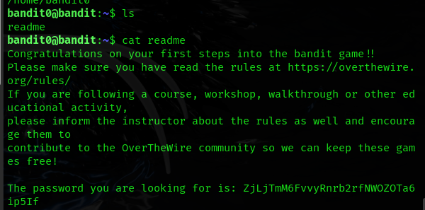

# Over The wire

Writeups for each level of the Bandit wargame from OverTheWire.  
Each level requires connecting to a remote server and solving Linux command-line challenges.


# **Level 0 → Level 1**


Connect SSH:

```bash
ssh:
sudo systemctl start ssh

sudo systemctl status ssh
```

ssh bandit0@bandit.labs.overthewire.org -p 2220



**Pass :**   ZjLjTmM6FvvyRnrb2rfNWOZOTa6ip5If


# **Level 1 → Level 2**


`cat ./-` is used to read a file literally named `-` in the current directory.

- `cat -` usually reads from **stdin**, so to avoid confusion, `./-` tells `cat` it's a file named  in the current directory.
- Use `./` to specify the exact file path and avoid misinterpreting `-` as an option.

**Pass:**  263JGJPfgU6LtdEvgfWU1XP5yac29mFx


# **Level 2 → Level 3**


option 1:


option 2:


To read a file named **`spaces in this filename`**, use quotes or escape spaces:

### Option 1: Use quotes

```bash
cat "spaces in this filename"

```

### Option 2: Escape spaces with backslashes

```bash
cat spaces\ in\ this\ filename

```

**Pass:**   MNk8KNH3Usiio41PRUEoDFPqfxLPlSmx


# **Level 3 → Level 4**


- `ls -a` lists **all files and directories**, including **hidden ones** (those starting with a dot `.`), in the current directory.
- `cat` is used to **display the contents of a file** on the terminal or to **combine multiple files**.

**Pass** -  2WmrDFRmJIq3IPxneAaMGhap0pFhF3NJ

# **Level 4 → Level 5**


- `ls -l` – list files with details
- `file ./*` – check the type of each file
- `cat ./filename` – read the content of the ASCII text file containing the password


Pass:  4oQYVPkxZOOEOO5pTW81FB8j8lxXGUQw


# **Level 5 → Level 6**


- `ls` – list files in the current directory
- `cd inhere/` – go into the `inhere` directory
- `ls` – list contents of `inhere`
- `find . -size 1033c` – find files exactly 1033 bytes in size
- `cat ./maybehere07/.file2` – read the file that contains the password

**Pass:** HWasnPhtq9AVKe0dmk45nxy20cvUa6EG


# **Level 6 → Level 7**


ssh bandit6@bandit.labs.overthewire.org -p 2220

pass : HWasnPhtq9AVKe0dmk45nxy20cvUa6EG

### Problem :

We need to find a file somewhere on the system that is exactly 33 bytes in size, owned by user `bandit7` and group `bandit6`. The file contains the password for the next level.


### Steps:

1. SSH into the server:
    
    ```
    ssh bandit6@bandit.labs.overthewire.org -p 2220
    
    ```
    
2. Search for the file:
    
    ```
    find / -user bandit7 -group bandit6 -size 33c 2>/dev/null
    
    ```
    
3. Read the content:
    
    ```
    cat /path/to/the/file
    
    ```
    


### Description

- `find /` searches the whole filesystem.
- `user` and `group` match file ownership.
- `size 33c` looks for files that are exactly 33 bytes (`c` = bytes).
- `2>/dev/null` hides permission denied errors.
- Once the path is found, `cat` is used to display the file's content (the password).

This is a typical use of `find` when you're hunting for files by size, owner, and group anywhere on the system.

**PASS**  : morbNTDkSW6jIlUc0ymOdMaLnOlFVAaj


# **Level 7 → Level 8**


ssh bandit7@bandit.labs.overthewire.org -p 2220

pass : morbNTDkSW6jIlUc0ymOdMaLnOlFVAaj

### Problem :

- Find the password from the file `data.txt`, next to the word `millionth`.

### Sol:

```bash
grep millionth data.txt

```


 **Description:**
    
    `grep` is used to search for lines containing the word `millionth` in the file. The line printed will contain the password.
    

**Pass** : dfwvzFQi4mU0wfNbFOe9RoWskMLg7eEc


# **Level 8 → Level 9**


ssh bandit8@bandit.labs.overthewire.org -p 2220

Pass : dfwvzFQi4mU0wfNbFOe9RoWskMLg7eEc

### Problem :

Find the unique line (that appears only once) in `data.txt` — it contains the password.

### Sol:

```bash
sort data.txt | uniq -u

```


- **Description:**
    
  
    
    - `sort data.txt` — puts all lines in order so that **duplicates come next to each other**
    - `uniq -u` — shows only lines that appear **once** (removes all duplicates)

**Pass:** 4CKMh1JI91bUIZZPXDqGanal4xvAg0JM


# **Level 9 → Level 10**

ssh bandit9@bandit.labs.overthewire.org -p 2220

Pass : 4CKMh1JI91bUIZZPXDqGanal4xvAg0JM

### Problem :

Find a human-readable string in `data.txt` that is **preceded by multiple `=` characters** — it contains the password.

### Sol:

```bash
strings data.txt | grep "===="

```


- **Description:**
    
    `strings` extracts readable text from a possibly binary file.
    
    `grep "===="` filters lines that have several `=` signs before the password.
    

**Pass:** FGUW5ilLVJrxX9kMYMmlN4MgbpfMiqey


# **Level 10 → Level 11**

ssh bandit10@bandit.labs.overthewire.org -p 2220

Pass : FGUW5ilLVJrxX9kMYMmlN4MgbpfMiqey

### Problem :

The file `data.txt` contains **base64-encoded data**. You need to decode it to get the password.

### Sol:

```bash
base64 -d data.txt

```


- **Description:**
    
    `base64 -d` (or `--decode`) decodes base64-encoded text back into its original form.
    
    This reveals the actual password hidden in `data.txt`.
    

**Pass :** dtR173fZKb0RRsDFSGsg2RWnpNVj3qRr


# **Level 11 → Level 12**


ssh bandit11@bandit.labs.overthewire.org -p 2220

Pass : dtR173fZKb0RRsDFSGsg2RWnpNVj3qRr

### **Problem:**

The password in `data.txt` is encrypted using **ROT13** (each letter rotated 13 positions).

### Sol:

```bash
cat data.txt | tr 'A-Za-z' 'N-ZA-Mn-za-m'

```


- **Description:**
    
    `tr` translates characters — here it performs a **ROT13 decryption**, shifting letters 13 places back in the alphabet.
    
    This reveals the password in readable text.
    

**Pass :** 7x16WNeHIi5YkIhWsfFIqoognUTyj9Q4


# **Level 12 → Level 13**

ssh bandit12@bandit.labs.overthewire.org -p 2220

Pass : 7x16WNeHIi5YkIhWsfFIqoognUTyj9Q4

### **Problem:**

- The file `data.txt` is a **hexdump** — it looks like text but is actually a *coded version* of a binary file.
- That original file has been **compressed multiple times** (gzip, bzip2, tar, etc.).
- You have to:
    1. Turn the hexdump back into a real file
    2. Then **unpack** or **decompress** it step-by-step until you get a password.

### **Steps:**

1. **Make a temporary folder to work in:**

```bash
mktemp -d

```

(You’ll get a folder like `/tmp/tmp.I64LTXbPOf`)

1. **Go into that folder:**

```bash
cd /tmp/tmp.I64LTXbPOf
```

1. **Copy the `data.txt` file here:**

```bash
cp ~/data.txt .

```

1. **Turn the hexdump into a real file:**

```bash
xxd -r data.txt > data

```

1. **Check what kind of file it is:**

```bash
file data

```

It might say something like `gzip compressed data`.

1. **Rename it with the right extension and unpack it:**

If it’s gzip:

```bash
mv data data.gz
gunzip data.gz

```

If it’s bzip2:

```bash
mv data data.bz2
bunzip2 data.bz2

```

If it’s a tar archive:

```bash
mv data data.tar
tar -xf data.tar

```

After each step, **run `file data` again**, and keep repeating the rename + extract until you get a **text file** with the password inside.


**Pass :**  FO5dwFsc0cbaIiH0h8J2eUks2vdTDwAn


# **Level 13 → Level 14**


ssh bandit13@bandit.labs.overthewire.org -p 2220

Pass :  FO5dwFsc0cbaIiH0h8J2eUks2vdTDwAn

### **Problem:**

The password for the next level is stored in `/etc/bandit_pass/bandit14`, but we don't get the password directly this time. Instead, we're given a **private SSH key** that allows us to log in as `bandit14`.

### Steps:

1. **Login to bandit13:**
    
    You start by logging into `bandit13` using the previous level’s password.
    
2. **Locate the private key:**
    
    In the home directory of `bandit13`, there is a file called `sshkey.private`. This file is the private key you’ll use to log in as `bandit14`.
    
3. **Create a temporary directory and copy the key:**
    
    It’s a good idea to work in a temporary directory. Create one and copy the private key file there.
    
    ```bash
    mkdir /tmp/mykeydir
    cd /tmp/mykeydir
    cp ~/sshkey.private .
    
    ```
    
4. **Set correct permissions on the key:**
    
    SSH requires private keys to be readable only by you. Set the correct file permissions using `chmod`.
    
    ```bash
    chmod 600 sshkey.private
    
    ```
    
5. **Login to bandit14 using the key:**
    
    Use the `ssh` command with the `-i` option to specify the private key file. Also, remember that OverTheWire uses port `2220`, not the default port `22`.
    
    ```bash
    ssh -i sshkey.private -p 2220 bandit14@localhost
    
    ```
    
6. **Read the password for the next level:**
    
    Once logged in as `bandit14`, read the password from the target file:
    
    ```bash
    cat /etc/bandit_pass/bandit14
    
    ```
    

That’s it. You now have the password to move to Level 14.


**Pass :** MU4VWeTyJk8ROof1qqmcBPaLh7lDCPvS


# **Level 14 → Level 15**

ssh bandit14@bandit.labs.overthewire.org -p 2220

Pass : MU4VWeTyJk8ROof1qqmcBPaLh7lDCPvS

### **Problem:**

Retrieve the password for the next level by submitting the current level’s password to port **30000** on **localhost**.

### **Steps:**

In this level, we are given a hint that a service is listening on port `30000` of the local machine. Our task is to connect to it and send our current password (for bandit14). If correct, the service will return the password for the next level.

1. I logged in to `bandit14` using the private SSH key obtained from the previous level.
2. I used the `nc` (netcat) command to connect to port 30000 on `localhost`.

```bash
nc localhost 30000

```

After the connection opened, I pasted the current password (for bandit14) and hit Enter.

```bash
bandit14@bandit:~$ nc localhost 30000
<you paste the password for bandit14 here and press Enter>
<server replies with the password for bandit15>

```


**Pass :** 8xCjnmgoKbGLhHFAZlGE5Tmu4M2tKJQo
